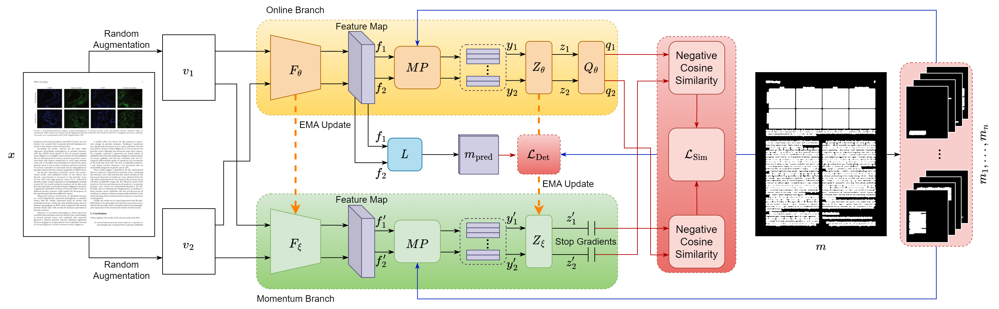

<div align="center">
	<br>
	<center></center>
	<br>
   <center>
      <a href="https://icdar2023.org">
      <picture>
      <source media="(prefers-color-scheme: dark)" srcset="https://i0.wp.com/icdar2023.org/wp-content/uploads/2022/08/ICDAR-2023-Logo-white-v10-color.png?fit=1818%2C461&ssl=1">
      <source media="(prefers-color-scheme: light)" srcset="https://i0.wp.com/icdar2023.org/wp-content/uploads/2022/08/ICDAR-2023-Logo-v10-color.png">
      
      </picture>
      </a>
      <!-- <a href="https://icdar2023.org"></a> -->
      <br>
      <br>
      <!--  -->
      <a href="https://doi.org/10.1007/978-3-031-41676-7_20"></a>
      <a href="https://arxiv.org/abs/2305.00795"></a>
      <a href="https://maitysubhajit.github.io/SelfDocSeg/"></a>
      <a href="https://github.com/MaitySubhajit/SelfDocSeg"></a>
      <br>
      <a href=""></a>
      <a href=""></a>
      <a href="https://github.com/MaitySubhajit/SelfDocSeg/blob/main/LICENSE"></a>
      <br>
      <br>
      <br>
   </center>
</div>

# [ICDAR 2023] SelfDocSeg: A self-supervised vision-based approach towards Document Segmentation :fire:
This is the official implementation of the paper [SelfDocSeg: A self-supervised vision-based approach towards Document Segmentation](https://doi.org/10.1007/978-3-031-41676-7_20) by [S. Maity](https://maitysubhajit.github.io), [S. Biswas](https://www.linkedin.com/in/sanketbiswas), [S. Manna](https://sadimanna.github.io), [A. Banerjee](https://www.linkedin.com/in/ayan-banerjee-733b5b16b), [J. Lladós](http://www.cvc.uab.es/team/?action=profile&id=379), [S. Bhatttacharya](http://www.iitkgp.ac.in/department/EC/faculty/ec-saumik), [U. Pal](https://www.isical.ac.in/~umapada) published in the proceedings of [ICDAR 2023](https://icdar2023.org).

### :loudspeaker: Recent Updates
- *18 Aug 2023* : Pre-release is available! A stable release will be coming soon if required. If you face any problem, please read the [FAQ & Issues](#mag-faqs-notes-issues) section and raise an issue if necessary.

---

:pushpin: [Requirements](#rocket-requirements)

:pushpin: [Getting Started](#clipboard-getting-started)

:pushpin: [FAQ & Issues](#mag-faqs-notes-issues)

:pushpin: [Acknowledgement](#star-acknowledgement)

:pushpin: [Citation](#bibtex)

### :wrench: Architecture
<div align="center"><center></center></div>

### :telescope: Qualitative Depiction of Segmentation
<div align="center"><center></center></div>

### :bar_chart: Quantitative Performance Measures
|         Methods        |    Self-Supervision   | mAP on DocLayNet |
|:----------------------:|:---------------------:|:----------------:|
|  Supervised Mask RCNN  |                       |       72.4       |
|    BYOL + Mask RCNN    |:ballot_box_with_check:|       63.5       |
| SelfDocSeg + Mask RCNN |:ballot_box_with_check:|       74.3       |

## :rocket: Requirements
- Python 3.9
- torch 1.12.0, torchvision 0.13.0, torchaudio 0.12.0
- pytorch-lightning 1.8.1
- lightly 1.2.35
- torchinfo 1.7.1
- torchmetric 0.11
- tensorboard 2.11
- scipy 1.9.3
- numpy 1.23
- scikit-learn 1.1.3
- opencv-python 4.6
- pillow 9.3
- pandas 1.5
- seaborn 0.12.1
- matplotlib 3.6
- tabulate 0.9
- tqdm 4.64
- pyyaml 6.0
- yacs 0.1.8
- pycocotools 2.0
- detectron2 0.6

## :clipboard: Getting Started
:white_check_mark: [Dataset](#Dataset)

:white_check_mark: [Pretraining](#pretraining)

:white_check_mark: [Finetuning](#finetuning)

:white_check_mark: [Visualization](#visualization)

### Dataset   
- For the self-supervised pretraining of SelfDocSeg we have used the [DocLayNet](https://developer.ibm.com/exchanges/data/all/doclaynet) dataset. It is also available for download in [:hugs: HuggingFace](https://huggingface.co/datasets/ds4sd/DocLayNet). The annotations are in COCO format. It should be extracted in the following structure. 
```
├── dataset                      # Dataset root directory
   ├── DocLayNet                 # DocLayNet dataset root directory
      ├── PNG                    # Directory containing all images
      |  ├── <image_file>.png
      |  ├── <image_file>.png
      |  ├── ...
      |
      └── COCO                   # Directory containing annotations
         ├── train.json          # train set annotation
         ├── val.json            # validation set annotation
         └── test.json           # test set annotation
```

- As DocLayNet is not a simple classification dataset we used a document classification dataset [RVL CDIP](https://adamharley.com/rvl-cdip), for linear evaluation protocols to make sure that the model is generalizing well. It is also available for download in [:hugs: HuggingFace](https://huggingface.co/datasets/aharley/rvl_cdip). The original dataset comes with separate image and annotation files. It needs to be restructured in `torchvision.datasets.ImageFolder` format as shown in the following, so that there are directories with each of the label names containing corresponding images for each of the dataset splits separately. We have used train + val split for training and test split for testing for kNN linear evaluation.
```
├── dataset                      # Dataset root directory
   ├── RVLCDIP_<split>           # RVL CDIP dataset split root directory, eg. 'RVLCDIP_train', 'RVLCDIP_test'
      ├── <label 0>              # Directory containing all images with label 0
      |  ├── <image_file>.tif
      |  ├── <image_file>.tif
      |  ├── ...
      |
      ├── <label 1>              # Directory containing all images with label 1
      |  ├── <image_file>.tif
      |  ├── <image_file>.tif
      |  ├── ...
      ├── <label 2>              # Directory containing all images with label 2
      |  ├── ...
      |
      ├── ...
      |
      └── <label 15>             # Directory containing all images with label 15
         ├── <image_file>.tif
         ├── <image_file>.tif
         ├── ...
```

### Pretraining
1. Run the script `pretraining/train_ssl.py` as `python pretraining/train_ssl.py --knn_train_root /path/to/train/ --knn_eval_root /path/to/test/ --dataset_root /path/to/pretraining/image/directory/` where `/path/to/train/`, `/path/to/test/` refer to RVL-CDIP kNN training split root directory 'RVLCDIP_train' and testing split root directory 'RVLCDIP_test' respectively and `/path/to/pretraining/image/directory/` refer to the DocLayNet image directory path. The complete set of options with default values is given below.
   ```
   python pretraining/train_ssl.py --num_eval_classes 16 --dataset_name DocLayNet --knn_train_root /path/to/train/ --knn_eval_root /path/to/test/ --dataset_root /path/to/pretraining/image/directory/ --logs_root ./benchmark_logs --num_workers 0 --max_epochs 800 --batchsize 8 --n_runs 1 --learning_rate 0.2 --lr_decay 5e-4 --wt_momentum 0.99 --bin_threshold 239 --kernel_shape rect --kernel_size 3 --kernel_iter 2 --eeta 0.001 --alpha 1.0 --beta 1.0
   ```
   If you want to resume training from a previous checkpoint add `--resume /path/to/checkpoint/` along with the command.

   To use multiple GPUs use `--distributed` flag and as additional controls, use `--sync_batchnorm` and `--gather_distributed` flags to synchronize batchnorms and gather features before loss calculation respectively across GPUs.

   Run `python pretraining/train_ssl.py --help` for the details.

2. The checkpoints and logs are being saved at `./benchmark_logs/<dataset_name>/version_<version num>/SelfDocSeg` directory. The `<version num>` depends on how many times the training is run and is automatically incremented from the largest `<version num>` available. If `--n_runs` passed is greater than 1, then `/run<run_number>` subdirectories are created to save data from each run. For the checkpoints, both the last epoch and the best kNN accuracy are the conditions to save weights in a subdirectory `checkpoints` under the aforementioned run directory.

3. Run `python pretraining/extract_encoder.py --checkpoint /path/to/saved/checkpont.ckpt --weight_save_path /path/to/save/weights.pth --num_eval_classes 16 --knn_train_root /path/to/train/ --knn_eval_root /path/to/test/ --dataset_root /path/to/pretraining/image/directory/` and the encoder weight will be extracted from the checkpoint and saved as the `.pth` file given in `save_path` in the default Torchvision ResNet50 format. The paths `/path/to/train/`, `/path/to/test/` refer to RVL-CDIP kNN training split root directory 'RVLCDIP_train' and testing split root directory 'RVLCDIP_test' respectively and `/path/to/pretraining/image/directory/` refer to the DocLayNet image directory path.

### Finetuning
1. Before finetuning the pretrained encoder on document segmentation, the weights need to be converted to the Detectron2 format by running the following.
   ```
   python finetuning/convert-torchvision-to-d2.py /path/to/save/weights.pth /path/to/save/d2/weights.pkl
   ```
   `/path/to/save/weights.pth` is the path to the extracted encoder weights from pretraining and `/path/to/save/d2/weights.pkl` is the file path where the converted weight file is to be saved in `.pkl` format.

2. Run the following command to start finetuning. The path `/path/to/DocLayNet/root/` refers to the root directory of the DocLayNet dataset in COCO format.
   ```
   python finetuning/train_net.py --num-gpus 1 --config-file finetuning/configs/COCO-InstanceSegmentation/mask_rcnn_R_50_FPN_3x.yaml MODEL.WEIGHTS /path/to/save/d2/weights.pkl --dataset_root /path/to/DocLayNet/root/
   ```
   The training configuration is defined in `finetuning/configs/COCO-InstanceSegmentation/mask_rcnn_R_50_FPN_3x.yaml` file and can be modified directly there or by parsing arguments in the command line. The path to the weights file can also be provided in the `.yaml` config file in the `WEIGHTS` key under `MODEL`.

   To train with multiple GPUs provide the number of available GPUs with `--num-gpus` argument. The learning rate and batch size might be required to be adjusted accordingly in the `.yaml` config file or in the command line, *eg.* `SOLVER.IMS_PER_BATCH 16 SOLVER.BASE_LR 0.02` for 8 GPUs.

3. The default path to save the logs and checkpoints is set in `finetuning/configs/COCO-InstanceSegmentation/mask_rcnn_R_50_FPN_3x.yaml` file as `finetuning/output/doclaynet/mask_rcnn/rn50/`. The checkpoint after finetuning can be used to perform the evaluation on the DocLayNet dataset by adding `--eval-only` flag along with the checkpoint in the command line as below.
   ```
   python finetuning/train_net.py --config-file finetuning/configs/COCO-InstanceSegmentation/mask_rcnn_R_50_FPN_3x.yaml --eval-only MODEL.WEIGHTS /path/to/finetuning/checkpoint.pkl
   ```

### Visualization
For visualization, run the following command. 
```
python visualize_json_results.py --input /path/to/output/evaluated/file.json --output /path/to/visualization/save/directory/ --dataset_root /path/to/DocLayNet/root/
```
The `/path/to/output/evaluated/file.json` refers to the `.json` file created during evaluation using Detectron2 in the output directory, default to `finetuning/output/doclaynet/mask_rcnn/rn50`. The `/path/to/visualization/save/directory/` refers to the directory path where the visualization results would be saved. The path `/path/to/DocLayNet/root/` refers to the root directory of the DocLayNet dataset in COCO format.

The confidence score threshold is set 0.6 by default and can be overridden by using `--conf-threshold 0.6` as an option in the command line.

## :mag: FAQs, Notes, Issues
- The `num_eval_classes 16` argument refers to the 16 classes in RVL-CDIP dataset used for linear evaluation.
- The pre-training can be done with any dataset by setting the pre-training dataset image folder by `--dataset_root /path/to/pretraining/image/directory/` and any dataset split in `torchvision.datasets.ImageFolder` format can be used for linear evaluation by using proper root paths to the split and number of classes, *eg.* `--num_eval_classes 16 --knn_train_root /path/to/train/ --knn_eval_root /path/to/test/`.
- The finetuning code in Detectron2 currently supports DocLayNet dataset only. If you wish to finetune on any other dataset, we recommend preparing the dataset in COCO format. Get help from [Detectron2 - Custom DataSet Tutorial](https://detectron2.readthedocs.io/en/latest/tutorials/datasets.html).
- The pretraining phase provides trained encoder weights in Torchvision format after extraction. Thus it can be used with any Mask RCNN implementation in PyTorch or any object detection framework instead of Detectron2.
- SelfDocSeg does not depend on textual guidance and hence can be used for documents of any language.

*If there is any query, please raise an issue. We shall try our best to help you out!*

## :star: Acknowledgement
The codes are implemented with the help of the two wonderful open-source repositories, [Lightly](https://github.com/lightly-ai/lightly) and [Detectron2](https://github.com/facebookresearch/detectron2).

## BibTeX  
If you use our code for your research, please cite our paper. Many thanks!

```
@inproceedings{maity2023selfdocseg,
title={SelfDocSeg: A Self-Supervised vision-based Approach towards Document Segmentation},
author={Subhajit Maity and Sanket Biswas and Siladittya Manna and Ayan Banerjee and Josep Lladós and Saumik Bhattacharya and Umapada Pal},
booktitle={International Conference on Document Analysis and Recognition (ICDAR)},
year={2023}}
```